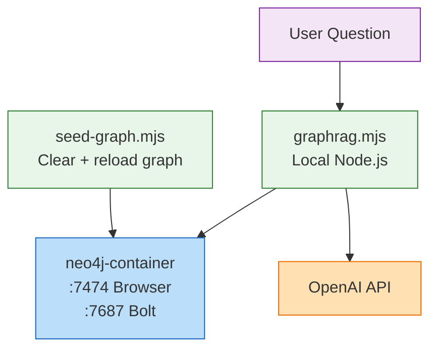
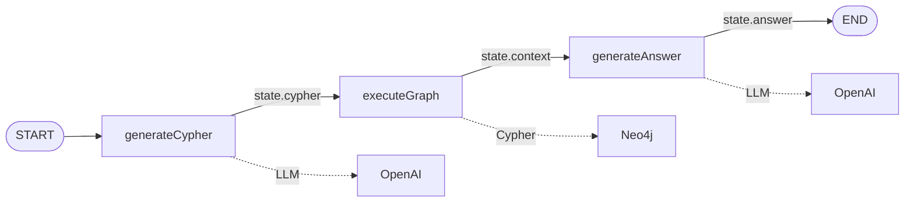
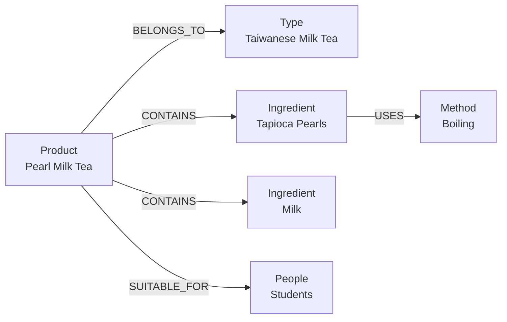

# Neo4j GraphRAG — Text-to-Cypher + Grounded Answers

A **GraphRAG** learning project: users ask questions in natural language, an LLM generates **Cypher** to query a **Neo4j** knowledge graph, then a second LLM call produces an answer **grounded in retrieved graph data** — not model memory.

Sample domain: English **bubble tea** knowledge graph (products, ingredients, types, methods, audiences).

## Tech Stack

| Stage | Solution |
|-------|----------|
| Graph database | Neo4j (Docker, Bolt + Browser) |
| Graph client | LangChain `Neo4jGraph` |
| Text-to-Cypher | OpenAI `gpt-4.1-mini` |
| Answer generation | OpenAI `gpt-4.1-mini` |
| Orchestration | LangGraph `StateGraph` |
| Seed data | `seed-graph.mjs` (programmatic) or `cypher.md` (manual) |

## Architecture

### Diagram 1 · Deployment



| Component | Type | Role |
|-----------|------|------|
| `graphrag.mjs` | Local script | LangGraph pipeline, reads `.env` |
| `seed-graph.mjs` | Local script | Wipes and reloads the English bubble tea graph |
| `neo4j-container` | Docker | Stores nodes and relationships |
| OpenAI API | Cloud | Cypher generation + final answer |

---

### Diagram 2 · LangGraph pipeline



| Node | Input | Output | What it does |
|------|-------|--------|--------------|
| `generateCypher` | `messages` (user question) | `cypher` | LLM writes a Cypher query from schema + question |
| `executeGraph` | `cypher` | `context` | Runs query in Neo4j, stores JSON results |
| `generateAnswer` | `context` + `messages` | `answer` | LLM answers using retrieval only; no hallucination |

**State fields**

| Field | Merge strategy | Description |
|-------|----------------|-------------|
| `messages` | Append | Conversation history (`HumanMessage`, etc.) |
| `cypher` | Replace | Latest generated Cypher |
| `context` | Replace | Latest Neo4j query result (JSON string) |
| `answer` | Replace | Final natural-language answer |

---

### Diagram 3 · Knowledge graph schema



**Nodes**

| Label | Meaning | Examples in seed data |
|-------|---------|----------------------|
| `Product` | Bubble tea product | Pearl Milk Tea |
| `Type` | Category | Taiwanese Milk Tea, Hong Kong Milk Tea |
| `Ingredient` | Ingredient | Tapioca Pearls, Fructose, Black Tea, Milk |
| `Method` | Preparation | Boiling, Brewing |
| `People` | Target audience | Young Adults, Students, Dessert Lovers |

**Relationships (direction is fixed — do not reverse)**

```
(Product)-[:BELONGS_TO]->(Type)
(Product)-[:CONTAINS]->(Ingredient)
(Product)-[:SUITABLE_FOR]->(People)
(Ingredient)-[:USES]->(Method)
```

Entity names are **case-sensitive**. The Cypher generator prompt lists exact names to reduce mismatches like `Taiwanese milk tea` vs `Taiwanese Milk Tea`.

## Quick Start

### 1. Start Neo4j

```bash
docker compose up -d
```

| Endpoint | URL |
|----------|-----|
| Browser | http://localhost:7474 |
| Bolt | `bolt://localhost:7687` |
| Credentials | `neo4j` / `12345678` |

### 2. Install dependencies

```bash
pnpm install
```

### 3. Configure `.env`

Create `.env` in the project root (gitignored):

```env
OPENAI_BASE_URL=https://api.openai.com/v1
OPENAI_API_KEY=sk-...
MODEL_NAME=gpt-4.1-mini
```

### 4. Seed the graph

GraphRAG reads **live Neo4j data**. Run the seed script (clears old data, loads English graph):

```bash
node seed-graph.mjs
```

Expected output:

```
Graph seeded successfully.
Node count: 13
Pearl Milk Tea ingredients: [ 'Tapioca Pearls', 'Fructose', 'Black Tea', 'Milk' ]
```

Verify in Browser:

```cypher
MATCH (p:Product {name: "Pearl Milk Tea"})-[:CONTAINS]->(i)
RETURN i.name;
```

### 5. Run GraphRAG

```bash
node graphrag.mjs
```

The script prints a Mermaid workflow diagram, then runs three sample questions in parallel.

**Example output**

```
Question: What ingredients does our Pearl Milk Tea contain?
Generated Cypher: MATCH (p:Product {name: "Pearl Milk Tea"})-[:CONTAINS]->(i:Ingredient) RETURN i.name
Retrieval results: [{"i.name":"Tapioca Pearls"},{"i.name":"Fructose"},...]
Final answer: Pearl Milk Tea contains Tapioca Pearls, Fructose, Black Tea, and Milk.
```

## Project Layout

```
neo4j-graphrag/
├── docker-compose.yml   # Neo4j + APOC
├── seed-graph.mjs       # One-command graph seed (recommended)
├── graphrag.mjs         # LangGraph GraphRAG pipeline
├── neo4j-test.mjs       # Native neo4j-driver CRUD exercises
├── cypher.md            # Cypher reference + manual seed steps
├── cypher2.md           # Updates, deletes, graph reset
├── .env                 # API keys (not committed)
└── README.md
```

| File | When to use |
|------|-------------|
| `seed-graph.mjs` | Fast reset + English seed before testing GraphRAG |
| `graphrag.mjs` | End-to-end Text-to-Cypher RAG |
| `neo4j-test.mjs` | Learn Driver basics (create / query / update / delete) |
| `cypher.md` | Study Cypher or seed manually in Browser |
| `cypher2.md` | Practice property updates and deletions |

## Learning Path

### Step 1 — Neo4j Driver basics

```bash
node neo4j-test.mjs
```

Uncomment functions at the bottom of `neo4j-test.mjs`:

1. `createData` — create nodes
2. `createRelation` — `CONTAINS` edge
3. `queryData` — traverse graph
4. `updateData` — set properties
5. `deleteRelation` / `deleteNode` — cleanup (`DETACH DELETE` for nodes with edges)

> `neo4j-test.mjs` is for learning only. Always run `node seed-graph.mjs` before GraphRAG so the full graph is present.

### Step 2 — Cypher in Browser

Open `cypher.md` and run queries in Neo4j Browser. Try multi-hop patterns:

```cypher
MATCH (p:Product {name: "Pearl Milk Tea"})-[:CONTAINS]->(i)-[:USES]->(m)
RETURN p.name, i.name, m.name;
```

### Step 3 — GraphRAG

Read `graphrag.mjs` top to bottom:

1. `generateCypher` — schema-aware prompt → Cypher string
2. `executeGraphQuery` — `graph.query(state.cypher)` → `context`
3. `generateAnswer` — grounded answer from `context`

Customize sample questions in the `Promise.all([...])` block at the bottom.

## How GraphRAG Differs from Plain Chat

| | Plain LLM chat | This project |
|--|----------------|--------------|
| Knowledge source | Model weights | Neo4j graph |
| Intermediate step | None | Executable Cypher |
| Answer grounding | May hallucinate | Prompt restricts to retrieval results |
| Best for | General knowledge | Structured domain facts with explicit relations |

The LLM's first output is **not** the final answer — it is a **database query**. The answer comes only after Neo4j returns rows.

## Troubleshooting

### Retrieval returns `[]`

| Cause | Fix |
|-------|-----|
| Graph not seeded | `node seed-graph.mjs` |
| Stale Chinese data | `seed-graph.mjs` clears automatically; or `MATCH (n) DETACH DELETE n` then re-seed |
| Name / relationship mismatch | Re-seed English graph; check generated Cypher in Browser |
| Wrong casing | Use exact names from seed data (`Taiwanese Milk Tea`, not `taiwanese milk tea`) |

### Answer says "cannot be derived from the graph"

Usually means `context` was empty (`[]`). Fix the graph data or the generated Cypher first.

### Process hangs after `node graphrag.mjs`

`graphrag.mjs` calls `graph.close()` in `finally`. If the shell still blocks, press `Ctrl+C`.

### `DELETE` fails on a node

Nodes with relationships need `DETACH DELETE`:

```cypher
MATCH (n) DETACH DELETE n;
```

See `cypher2.md` for selective deletes.

### Reset everything

```bash
node seed-graph.mjs
```

## Sample Questions

These work with the default seed graph:

- `What ingredients does our Pearl Milk Tea contain?`
- `What ingredients are used in Taiwanese milk tea drinks?`
- `Who is Pearl Milk Tea suitable for?`
- `What preparation method is used for Tapioca Pearls?`

## References

- [Neo4j Browser](https://neo4j.com/docs/browser-manual/current/)
- [Cypher Manual](https://neo4j.com/docs/cypher-manual/current/)
- [LangGraph JS](https://langchain-ai.github.io/langgraphjs/)
- [LangChain Neo4jGraph](https://js.langchain.com/docs/integrations/graphs/neo4j)
